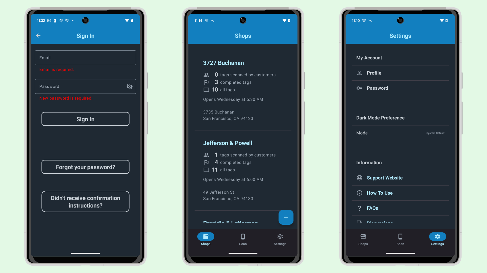

# NativeAppTemplate-Free-Android

NativeAppTemplate-Free-Android is a modern, comprehensive, and production-ready native Android app with user authentication.  
This Android app is a free version of  [NativeAppTemplate-Android (Solo)](https://nativeapptemplate.com/products/android-solo) and [NativeAppTemplate-Android (Team)](https://nativeapptemplate.com/products/android-team).  

The iOS version is available here: [NativeAppTemplate-Free-iOS](https://github.com/nativeapptemplate/NativeAppTemplate-Free-iOS).  

## Overview

NativeAppTemplate-Free-Android is configured to connect to `api.nativeapptemplate.com`.  
You can purchase the source code for the backend server APIs, made with Ruby on Rails, that power `api.nativeapptemplate.com`:

- [NativeAppTemplate-API (Solo)](https://nativeapptemplate.com/products/api-solo)  
- [NativeAppTemplate-API (Team)](https://nativeapptemplate.com/products/api-team)

### Screenshots



### Features

NativeAppTemplate-Free-Android uses modern Android development tools and practices, including:

- **100% Kotlin**
- **100% Jetpack Compose**
- **Hilt** (Dependency Injection)
- **Retrofit2** (Networking)
- **[Proto DataStore](https://developer.android.com/topic/libraries/architecture/datastore)**  
- **[Android Modern App Architecture](https://developer.android.com/topic/architecture#modern-app-architecture)**  
- Inspired by [nowinandroid](https://github.com/android/nowinandroid) and [emitron-Android](https://github.com/razeware/emitron-Android)

#### Included Features

- Onboarding
- Sign Up / Sign In / Sign Out
- Email Confirmation
- Forgot Password
- Input Validation
- CRUD Operations for Shops (Create/Read/Update/Delete)
- And more!

#### Not Included in the Free Version

The full versions ([NativeAppTemplate-Android (Solo)](https://nativeapptemplate.com/products/android-solo) and [NativeAppTemplate-Android (Team)](https://nativeapptemplate.com/products/android-team)) include additional advanced features:

- URL Path-Based Multitenancy (e.g., prepends `/:account_id/` to URLs)
- User Invitation to Organizations
- Role-Based Permissions and Access Control

## Getting Started

To get started, clone this repository:

```bash
git clone https://github.com/nativeapptemplate/NativeAppTemplate-Free-Android.git
```

## Requirements

To run this app successfully, ensure you have:

- An Android device or emulator with API level 26 or higher.

## Running with the NativeAppTemplate-API on localhost

To connect to a local API server, update the following configuration in the build.gradle.kts (Module: app):

```kotlin
buildConfigField("String", "DOMAIN","\"192.168.1.21\"")
buildConfigField("String", "PORT","\"3000\"")
buildConfigField("String", "SCHEME","\"http\"")
```

## Blog

- [Key Differences in MVVM Architecture: iOS vs. Android](https://medium.com/@dadachix/key-differences-in-mvvm-architecture-ios-vs-android-e239d30b2ea7)

## Contributing

If you have an improvement you'd like to share, create a fork of the repository and send us a pull request.
